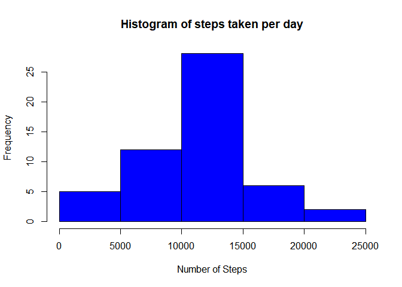
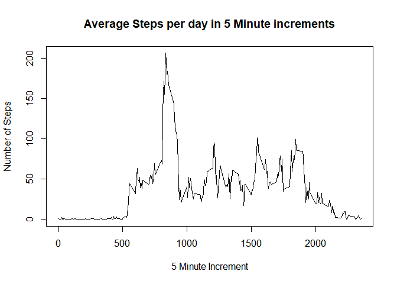
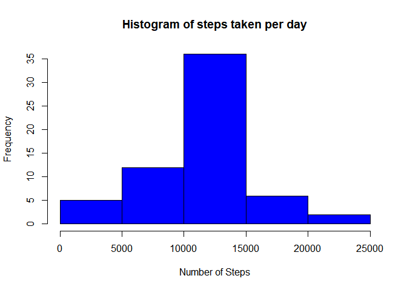
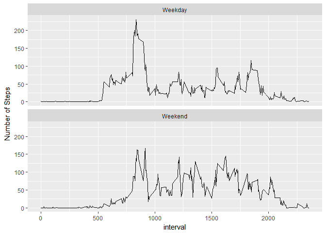

## Loading and preprocessing the data


This loads the data, transforms the date column into a date and then aggregates the number of steps by date, so that we get the number of steps taken each day. Note that the aggregate function omits NA values by default. 

I am somewhat confused on the parts where it asks for histogram, mean, and median. The assignment says "number of steps taken each day" whcih I have put below. However, it seems it like it could be asking for "number of steps taken each day for each interval"? I'm not sure. Maybe I'm reading it or doing something wrong??


```r
library(lubridate)
```

```
## 
## Attaching package: 'lubridate'
```

```
## The following object is masked from 'package:base':
## 
##     date
```

```r
library(ggplot2)

activity <- read.csv("activity.csv")

activity$date <- ymd(activity$date)

steps  <- aggregate(steps ~ date, activity, sum)

steps2 <- aggregate(steps ~ interval, activity, mean)
```


## What is mean total number of steps taken per day?

###Histogram

This is a histogram showing the frequency of the number of steps taken each day.


```r
hist(steps$steps,
  col  = "blue",
  main = "Histogram of steps taken per day",
  xlab = "Number of Steps"
)
```

<!-- -->

###The Mean and The Median

This shows the mean and median of steps taken per day


```r
mean(steps$steps)
```

```
## [1] 10766.19
```

```r
median(steps$steps)
```

```
## [1] 10765
```


## What is the average daily activity pattern?

###Time Series Plot

Using the steps2 data frame created above, the plot below shows the time interval in 5 minute increments on the x axis.


```r
plot(x = steps2$interval, y = steps2$steps,
  type = "l",
  main = "Average Steps per day in 5 Minute increments",
  xlab = "5 Minute Increment",
  ylab = "Number of Steps"
)
```

<!-- -->

## Imputing missing values

First, a table is created where TRUE shows the number of missing values in the activity set. Second, the activity dataset is subsetted based on whether there are missing values, and the mean of the steps for each interval is merged in to impute values. 


```r
table(is.na(activity$steps))
```

```
## 
## FALSE  TRUE 
## 15264  2304
```

```r
stepsReport <- subset(activity, is.na(activity$steps) == FALSE)
stepsNA     <- subset(activity, is.na(activity$steps) == TRUE)

stepsNA$steps <- NULL

stepsImpute <- merge(x = stepsNA, y = steps2, 
  by = "interval", all.x = TRUE)

activityImputed <- rbind(stepsReport, stepsImpute)

steps2Hist <- aggregate(steps ~ date, activityImputed, sum)

hist(steps2Hist$steps,
  col  = "blue",
  main = "Histogram of steps taken per day",
  xlab = "Number of Steps"
)
```

<!-- -->

```r
mean(steps2Hist$steps)
```

```
## [1] 10766.19
```

```r
median(steps2Hist$steps)
```

```
## [1] 10766.19
```

With the NA values imputed based on interval means, the median increases slightly and the meadian and the mean are now the same. 

## Are there differences in activity patterns between weekdays and weekends?


```r
activityImputed$weekday <- weekdays(activityImputed$date)

activityImputed$weekday[
  activityImputed$weekday %in% c("Monday","Tuesday","Wednesday",
                                 "Thursday","Friday")] <- "Weekday"

activityImputed$weekday[
  activityImputed$weekday %in% c("Saturday","Sunday")] <- "Weekend"

steps2Impute <- aggregate(
  steps ~ interval + weekday, activityImputed, mean
)

ggplot(
  data = steps2Impute, 
  aes(x = interval, y = steps, group = weekday)) + 
  ylab("Number of Steps") +
  geom_line() + facet_wrap(~weekday, ncol = 1
)
```

<!-- -->
